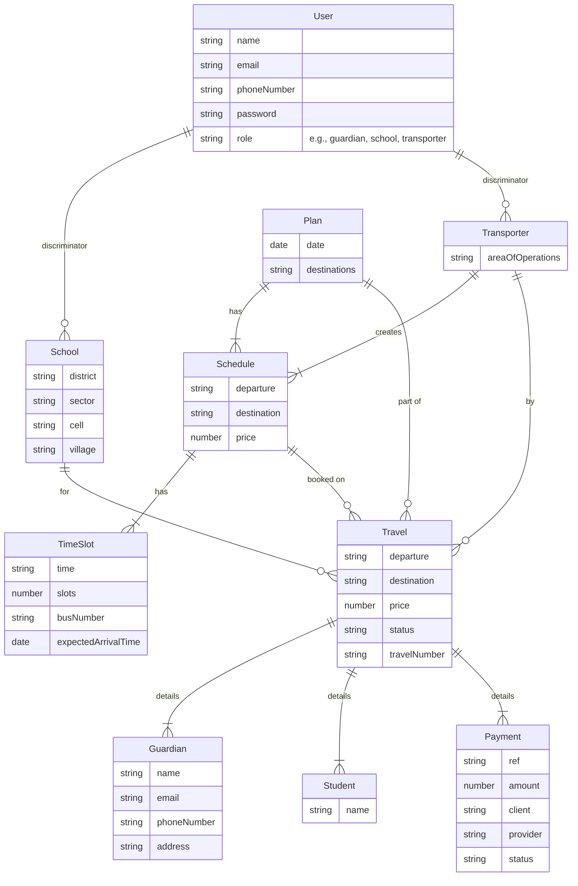
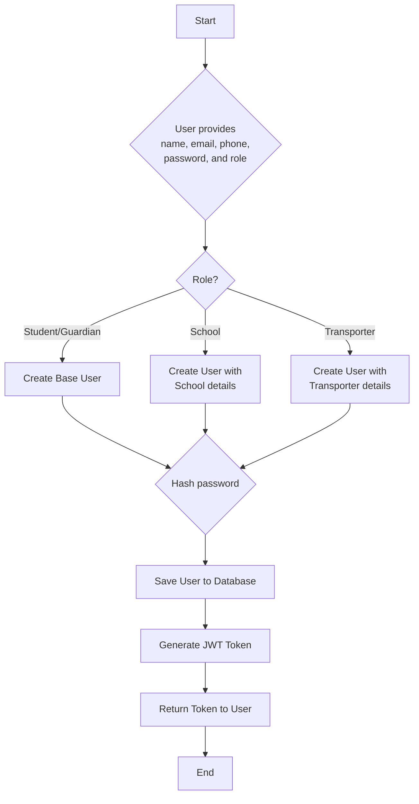
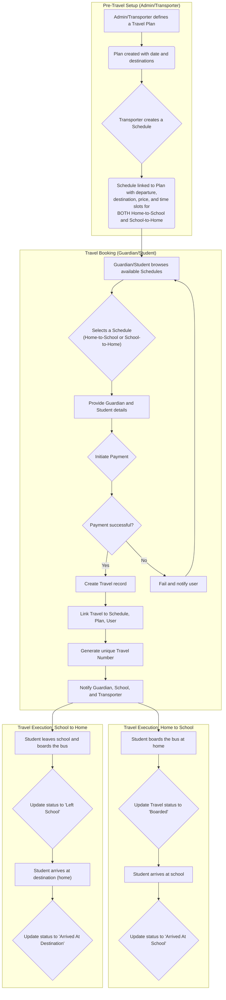

# EduMove: Your Partner in Educational Transportation

EduMove is a robust, Node.js-powered backend solution engineered to streamline and manage educational transportation services. It serves as a central hub for schools, transporters, and guardians, ensuring safe, efficient, and transparent travel for students.

## 📖 Table of Contents

- [✨ Features](#-features)
- [🏗️ System Architecture](#️-system-architecture)
- [🗃️ Database Schema](#️-database-schema)
- [🔄 Workflows](#-workflows)
  - [User Registration](#user-registration)
  - [Travel Booking](#travel-booking)
- [🔌 API Documentation](#-api-documentation)
- [🚀 Getting Started](#-getting-started)
- [📁 Project Structure](#-project-structure)
- [🤝 Contributing](#-contributing)
- [📜 License](#-license)

## ✨ Features

- **Role-Based Access Control (RBAC)**: Differentiated access and functionalities for Admins, Schools, Transporters, and Guardians/Students.
- **Secure Authentication**: Utilizes JSON Web Tokens (JWT) for secure, stateless authentication.
- **Travel Planning & Scheduling**: Enables transporters to define travel plans and detailed schedules.
- **Real-Time Booking**: Allows guardians to book travel for students in real-time.
- **Payment Integration**: Integrated with PayPack for seamless and secure payment processing.
- **Email Notifications**: Keeps users informed about bookings, payments, and other important events via email.
- **Input Validation**: Ensures data integrity through rigorous server-side validation.
- **Comprehensive API Documentation**: Leverages Swagger for clear and interactive API documentation.

## 🏗️ System Architecture

EduMove is built on a modern, scalable, and maintainable technology stack:

- **Backend**: Node.js with Express.js for building robust RESTful APIs.
- **Database**: MongoDB with Mongoose for flexible, schema-based data modeling.
- **Authentication**: JWT and bcrypt for password hashing.
- **Payment**: PayPack for handling financial transactions.
- **Email**: Resend for reliable email delivery.

## 🗃️ Database Schema

The database schema is designed to be flexible and scalable, using Mongoose discriminators to manage different user roles within a single collection.



## 🔄 Workflows

### User Registration

The user registration process is designed to handle different user roles seamlessly.



### Travel Booking

The travel booking workflow involves multiple stakeholders and is designed for clarity and efficiency. It covers the journey from home to school and back.



## 🔌 API Documentation

Our API is fully documented using Swagger. To access the interactive documentation, run the application and navigate to `/api-docs` in your browser.

- **Local**: [http://localhost:3000/api-docs](http://localhost:3000/api-docs)
- **Production**: [https://edumove.onrender.com/api-docs](https://edumove.onrender.com/api-docs)

## 🚀 Getting Started

### Prerequisites

- [Node.js](https://nodejs.org/) (v14 or higher)
- [MongoDB](https://www.mongodb.com/) instance (local or cloud-hosted)
- A [PayPack](https://paypack.rw/) account for payment processing.
- A [Resend](https://resend.com/) account for email services.

### Installation

1.  **Clone the repository:**

    ```bash
    git clone <repository-url>
    cd edumove
    ```

2.  **Install dependencies:**

    ```bash
    npm install
    ```

3.  **Set up environment variables:**
    Create a `.env` file in the root of the project by copying the `.env.example` file.
    ```bash
    cp .env.example .env
    ```
    Update the `.env` file with your credentials:
    ```
    PORT=3000
    MONGODB_URI=<your-mongodb-uri>
    JWT_SECRET=<your-jwt-secret>
    PAYPACK_API_KEY=<your-paypack-api-key>
    RESEND_API_KEY=<your-resend-api-key>
    ```

### Running the Application

- **Development mode** (with auto-reloading):
  ```bash
  npm run dev
  ```
- **Production mode**:
  ```bash
  npm start
  ```

## 📁 Project Structure

```
edumove/
├── src/
│   ├── app.js           # Express app configuration
│   ├── server.js        # Server entry point
│   ├── controller/      # Business logic for routes
│   ├── model/           # MongoDB data models
│   ├── routes/          # API route definitions
│   ├── middlewares/     # Custom middleware (e.g., auth)
│   ├── swagger/         # Swagger documentation setup
│   └── utils/           # Utility functions (e.g., email, payment)
├── .env                 # Environment variables
├── .gitignore           # Git ignore file
├── package.json         # Project metadata and dependencies
└── README.md            # This file
```
