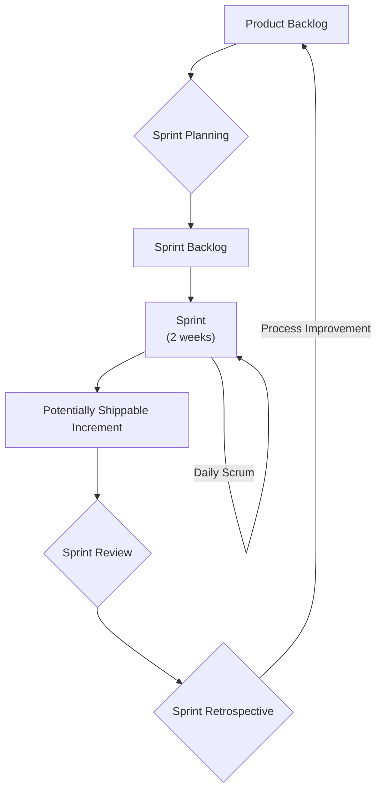

# Agile Methodology (Scrum Framework)

This document describes the Agile methodology, specifically the Scrum framework, that was used for the Edumove project.

## Project Timeline

The project ran from **January 2025 to June 2025**.

The 6-month timeline was divided into 2-week sprints, resulting in 12 sprints over the course of the project.

### High-Level Sprint Breakdown

Below is a retrospective timeline of the features completed during each phase of the project.

| Sprints   | Month         | Key Deliverables                                                                                                                                                                                                                     |
| :-------- | :------------ | :----------------------------------------------------------------------------------------------------------------------------------------------------------------------------------------------------------------------------------- |
| **1-2**   | January 2025  | **Foundation & Core Authentication:** - Project setup & environment configuration. - User registration & login (JWT). - Role-based access control (Guardian, School, Transporter, Admin). - User profile management. |
| **3-4**   | February 2025 | **Planning & Scheduling:** - Schools and Transporters could create and manage transport schedules. - Guardians could view available travel plans and schedules.                                                              |
| **5-6**   | March 2025    | **Travel Booking & Payments:** - Guardians could book travels for students. - Integrated Paypack for payments. - Handled payment success, failure, and verification states.                                              |
| **7-8**   | April 2025    | **Real-time Tracking & Notifications:** - Implemented travel status updates (e.g., Boarded, Arrived). - Set up email notifications for booking confirmation and status changes.                                              |
| **9-10**  | May 2025      | **Dashboards & User Experience:** - Developed dashboards for each user role to view relevant information. - Refined the user interface and overall user experience.                                                          |
| **11-12** | June 2025     | **Finalization & Deployment:** - Conducted comprehensive end-to-end testing. - Performed final bug fixes and performance optimizations. - Finalized API documentation (Swagger). - Deployed to production.           |

## Scrum Framework

We adopted the Scrum framework to manage our project. Scrum is an agile framework for developing, delivering, and sustaining complex products. Our adoption of this framework was key to the project's success.

### Scrum Workflow

The diagram below illustrates the iterative workflow followed in each sprint.

### Key Roles

- **Product Owner:** Was responsible for maximizing the value of the product by managing the Product Backlog.
- **Scrum Master:** Acted as a servant-leader for the Scrum Team, ensuring the team adhered to Scrum principles and practices.
- **Development Team:** A self-organizing, cross-functional team of professionals who performed the work of creating a potentially releasable Increment of a "Done" product at the end of each Sprint.

### Scrum Events (Ceremonies)

- **Sprint:** A time-box of two weeks during which a "Done," usable, and potentially releasable product Increment was created.
- **Sprint Planning:** At the beginning of each sprint, the team held a planning meeting to define the work to be performed.
- **Daily Scrum:** A 15-minute daily meeting for the Development Team to synchronize activities and create a plan for the next 24 hours.
- **Sprint Review:** Held at the end of the Sprint to inspect the Increment and adapt the Product Backlog if needed.
- **Sprint Retrospective:** After each Sprint Review, the team held a retrospective to reflect on the process and identify areas for improvement for the next Sprint.

### Scrum Artifacts

- **Product Backlog:** An ordered list of everything that was known to be needed in the product. It was the single source of requirements for any changes made to the product.
- **Sprint Backlog:** The set of Product Backlog items selected for a Sprint, plus a plan for delivering the product Increment and realizing the Sprint Goal.
- **Increment:** The sum of all the Product Backlog items completed during a Sprint and all previous Sprints. At the end of a Sprint, the new Increment was "Done," meaning it was in a usable condition and met the Scrum Team's definition of "Done."
